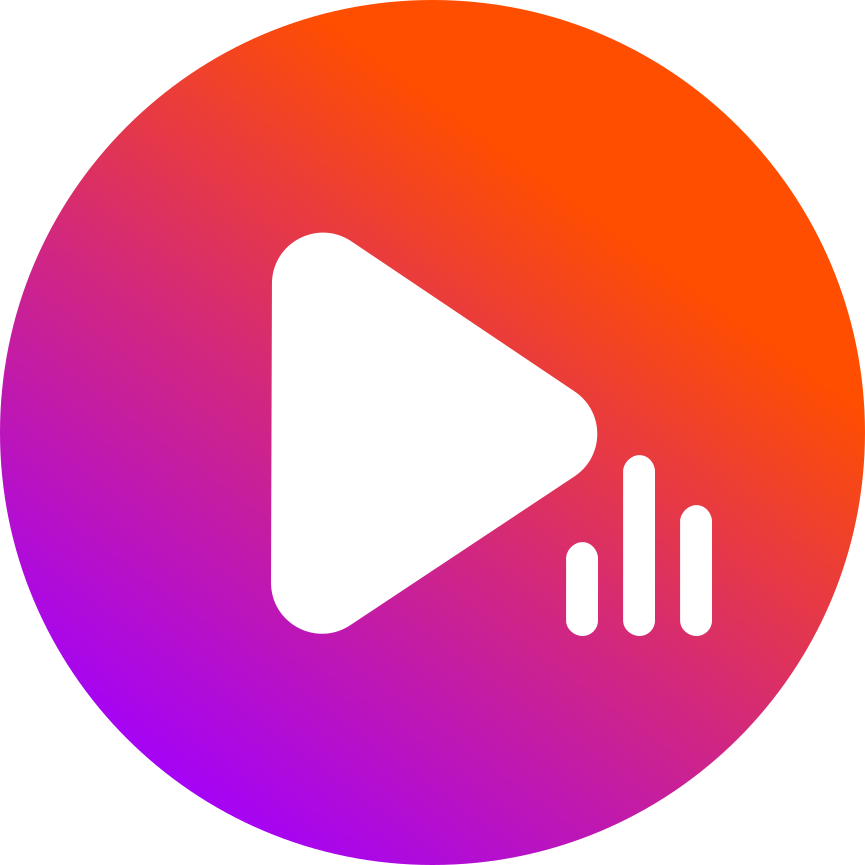

<div align="center">
  
  <h1>AudioWeb Music Player</h1>
</div>


A modern, feature-rich web-based audio player built with Next.js, React, and TypeScript. AudioWeb provides a seamless music listening experience with advanced features like shuffle, repeat modes, equalizer, sleep timer, and synchronized lyrics display.

## ✨ Features

### 🎵 Core Audio Features
- **Universal Audio Support** - Play various audio formats (MP3, FLAC, WAV, OGG, etc.)
- **Drag & Drop Upload** - Simply drag audio files into the player
- **Playlist Management** - Create and manage playlists with ease
- **Smart Shuffle** - Advanced shuffle algorithm with history tracking
- **Repeat Modes** - Off, Repeat All, Repeat One
- **Crossfade & Gapless Playback** - Smooth transitions between tracks

### 🎛️ Advanced Controls
- **7-Band Equalizer** - Fine-tune your audio with presets and custom settings
- **Sleep Timer** - Auto-stop playback after specified time
- **Volume Control** - Precise volume adjustment with visual feedback
- **Progress Seeking** - Click to jump to any position in the track

### 🎨 User Experience
- **Responsive Design** - Optimized for desktop, tablet, and mobile devices
- **Dark Theme** - Elegant dark interface with glassmorphism effects
- **Lyrics Display** - Synchronized lyrics with time-based highlighting (.lrc support)
- **Album Art Display** - Automatic extraction and display of embedded artwork
- **Keyboard Shortcuts** - Control playback without touching the interface
- **Media Session API** - Integration with browser/OS media controls

### 🎭 Visual Elements
- **Lottie Animations** - Smooth, interactive animations
- **Audio Visualizations** - Real-time audio frequency visualization
- **Glassmorphism UI** - Modern, translucent design elements
- **Smooth Transitions** - Polished animations throughout the interface

## 🚀 Getting Started

### Prerequisites
- Node.js 18.x or higher
- npm, yarn, pnpm, or bun package manager

### Installation

1. **Clone the repository**
   ```bash
   git clone https://github.com/yourusername/audioweb.git
   cd audioweb
   ```

2. **Install dependencies**
   ```bash
   npm install
   # or
   yarn install
   # or
   pnpm install
   ```

3. **Start the development server**
   ```bash
   npm run dev
   # or
   yarn dev
   # or
   pnpm dev
   ```

4. **Open in browser**
   Navigate to [http://localhost:3000](http://localhost:3000) to see the application.

## 📁 Project Structure

```
audioweb/
├── public/
│   ├── images/          # Static images and icons
│   └── lottie/          # Lottie animation files
├── src/
│   ├── app/
│   │   ├── components/
│   │   │   ├── player/  # Audio player components
│   │   │   │   ├── hooks/       # Custom React hooks
│   │   │   │   ├── AlbumArt.tsx
│   │   │   │   ├── Player.tsx   # Main player component
│   │   │   │   └── ...
│   │   │   ├── navbar.tsx
│   │   │   └── ...
│   │   ├── globals.css  # Global styles
│   │   ├── layout.tsx   # Root layout
│   │   └── page.tsx     # Home page
│   └── types/           # TypeScript type definitions
├── package.json
└── README.md
```

## 🛠️ Built With

- **[Next.js 16](https://nextjs.org/)** - React framework for production
- **[React 19](https://reactjs.org/)** - UI library
- **[TypeScript](https://www.typescriptlang.org/)** - Type-safe JavaScript
- **[Tailwind CSS](https://tailwindcss.com/)** - Utility-first CSS framework
- **[Lottie React](https://github.com/Gamote/lottie-react)** - Animation library
- **[JSMediaTags](https://github.com/aadsm/jsmediatags)** - Audio metadata extraction
- **[Music Metadata Browser](https://github.com/Borewit/music-metadata-browser)** - Enhanced metadata support

## 🎯 Usage

### Basic Playback
1. **Upload Audio**: Drag and drop audio files onto the player or use the upload button
2. **Play/Pause**: Click the play button or use spacebar
3. **Navigate**: Use previous/next buttons or arrow keys
4. **Seek**: Click anywhere on the progress bar to jump to that position

### Advanced Features
- **Shuffle**: Click the shuffle button to enable random playback
- **Equalizer**: Access the 7-band equalizer for audio customization
- **Sleep Timer**: Set a timer to automatically stop playback
- **Lyrics**: Upload .lrc files alongside audio for synchronized lyrics

### Keyboard Shortcuts
- `Space` - Play/Pause
- `←/→` - Previous/Next track
- `↑/↓` - Volume up/down
- `M` - Mute/Unmute
- `S` - Toggle shuffle
- `R` - Cycle repeat modes

## 🔧 Development

### Available Scripts
- `npm run dev` - Start development server
- `npm run build` - Build for production
- `npm run start` - Start production server
- `npm run lint` - Run ESLint

### Contributing
1. Fork the repository
2. Create a feature branch (`git checkout -b feature/amazing-feature`)
3. Commit your changes (`git commit -m 'Add amazing feature'`)
4. Push to the branch (`git push origin feature/amazing-feature`)
5. Open a Pull Request

## 📱 Responsive Design

AudioWeb is fully responsive and provides optimized experiences across devices:
- **Desktop**: Full-featured interface with side-by-side layout
- **Tablet**: Adapted layout with touch-friendly controls
- **Mobile**: Streamlined interface optimized for small screens

## 🌐 Browser Support

- Chrome 90+
- Firefox 88+
- Safari 14+
- Edge 90+

*Note: Some features require modern browser APIs (Web Audio API, Media Session API)*

## 📄 License

This project is licensed under the MIT License - see the [LICENSE](LICENSE) file for details.

## 🤝 Acknowledgments

- Audio processing powered by Web Audio API
- Icons and animations from various open-source libraries
- Inspired by modern music players and audio applications

## 📞 Support

If you encounter any issues or have questions:
- Open an issue on GitHub
- Drop a mail
